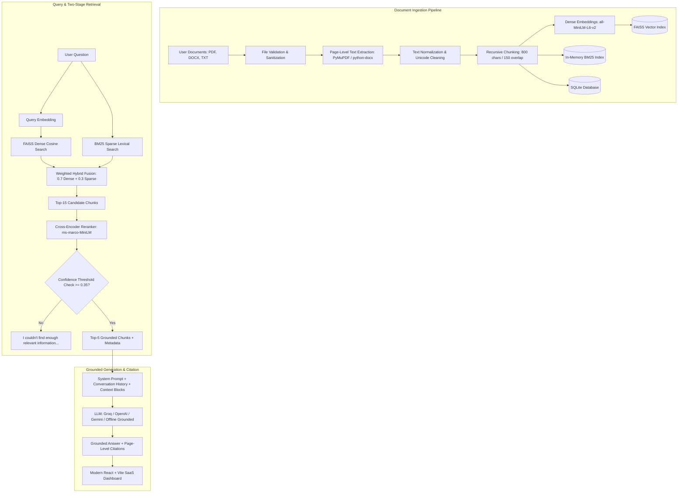

# RAGify — Intelligent Document RAG Chatbot

[](https://python.org)
[](https://fastapi.tiangolo.com)
[](https://github.com/facebookresearch/faiss)
[](https://github.com/dorianbrown/rank_bm25)
[](https://react.dev)
[](https://tailwindcss.com)
[](LICENSE)

> A production-grade, modular Retrieval-Augmented Generation (RAG) platform with multi-document ingestion (PDF with page numbers, DOCX, TXT), hybrid search (Dense FAISS + Sparse BM25), cross-encoder reranking, strict anti-hallucination verification, source citations, and an automated evaluation suite.

---

## Table of Contents
- [1. Project Overview](#1-project-overview)
- [2. Problem Statement](#2-problem-statement)
- [3. Key Features](#3-key-features)
- [4. Core RAG Architecture](#4-core-rag-architecture)
- [5. Technology Stack](#5-technology-stack)
- [6. Directory Structure](#6-directory-structure)
- [7. How Retrieval Works](#7-how-retrieval-works)
  - [Chunking Strategy](#chunking-strategy)
  - [Dense Vector Search (FAISS)](#dense-vector-search-faiss)
  - [Sparse Keyword Search (BM25)](#sparse-keyword-search-bm25)
  - [Hybrid Weighted Fusion](#hybrid-weighted-fusion)
  - [Cross-Encoder Reranking](#cross-encoder-reranking)
  - [Anti-Hallucination & Confidence Thresholding](#anti-hallucination--confidence-thresholding)
  - [Page-Level Citations](#page-level-citations)
- [8. Evaluation Methodology](#8-evaluation-methodology)
- [9. Installation & Setup](#9-installation--setup)
- [10. Running the Application](#10-running-the-application)
- [11. API Documentation](#11-api-documentation)
- [12. Automated Testing](#12-automated-testing)
- [13. Production Deployment Guide](#13-production-deployment-guide)
- [14. Vector Store Cloud Migration Path](#14-vector-store-cloud-migration-path)
- [15. Limitations & Future Work](#15-limitations--future-work)
- [16. How I Would Explain This Project in an Interview](#16-how-i-would-explain-this-project-in-an-interview)
- [17. Resume Description](#17-resume-description)

---

## 1. Project Overview

**RAGify** is an end-to-end, full-stack Generative AI system built to solve the core challenges of deploying LLMs on proprietary documents: context-window overflow, outdated knowledge, and factual hallucinations.

Instead of naively dumping entire documents into a prompt, RAGify runs a rigorous two-stage retrieval pipeline:
1. **First-Stage Hybrid Retrieval**: Parallel dense vector search (FAISS IndexFlatIP over unit-normalized embeddings) and sparse lexical search (BM25Okapi) merged via min-max normalized weighted fusion.
2. **Second-Stage Cross-Encoder Reranking**: Full cross-attention between user query and candidate chunks to eliminate false-positive semantic matches.
3. **Grounded Generation & Citation**: Grounded LLM generation with strict system constraints and page-number citations. If confidence is below the safety threshold, generation is rejected to prevent hallucinations.

---

## 2. Problem Statement

Standard Large Language Models (LLMs) suffer from:
1. **Hallucination**: Inventing convincing but false facts when uncertain.
2. **Context Window Limits & Cost**: Sending 50-page PDFs into an LLM context on every prompt wastes tokens and exceeds attention budgets.
3. **Keyword Blindspots in Pure Semantic Search**: Dense vector models frequently struggle with exact product IDs, acronyms, code symbols, and specialized names.
4. **Semantic Blindspots in Pure Keyword Search**: Lexical BM25 search fails to match synonyms or conceptual queries without exact token overlap.

**RAGify solves all four problems simultaneously** through hybrid retrieval, cross-encoder reranking, page-level source attribution, and safety thresholding.

---

## 3. Key Features

- **Multi-Format Ingestion**:
  - PDF: Extracted with `PyMuPDF` (`fitz`), preserving exact 1-indexed page numbers.
  - DOCX: Extracted with `python-docx`, parsing paragraphs and tables.
  - TXT: Robust UTF-8 / latin-1 stream handling.
- **Recursive Character Chunking**:
  - Configurable `chunk_size` (default: 800) and `chunk_overlap` (default: 150) preserving sentence boundaries.
- **Dense Vector Search (FAISS)**:
  - `sentence-transformers/all-MiniLM-L6-v2` generating 384-dimensional unit L2-normalized embeddings.
  - FAISS `IndexFlatIP` computing exact cosine similarity in milliseconds.
- **Sparse Lexical Search (BM25)**:
  - In-memory `BM25Okapi` index capturing exact keywords, acronyms, and alphanumeric terms.
- **Weighted Hybrid Fusion**:
  - Normalized formula: $Score = (0.7 \times S_{\text{dense}}) + (0.3 \times S_{\text{sparse}})$, dynamically tunable via Settings.
- **Cross-Encoder Reranking**:
  - `cross-encoder/ms-marco-MiniLM-L-6-v2` reordering top-15 candidates down to the top-5 most relevant chunks.
- **Anti-Hallucination Grounding**:
  - Strict system prompt. If retrieval confidence $< 0.35$, the system refuses to generate ungrounded answers.
- **Source Attribution**:
  - Returns document name, page number, chunk ID, relevance score, and expandable context preview.
- **Multi-Document & Multi-Turn Chat**:
  - Searches across all uploaded files simultaneously; conversational memory with sliding-window truncation.
- **Automated RAG Evaluation Suite**:
  - Computes Precision@K, Recall@K, Context Relevance, Answer Faithfulness, and Response Latency against benchmark datasets.

---

## 4. Core RAG Architecture



---

## 5. Technology Stack

### Backend
- **Framework**: Python 3.9+, FastAPI, Uvicorn, Pydantic v2, Pydantic-Settings
- **Document Extractors**: PyMuPDF (`fitz`), python-docx
- **Embedding Model**: `sentence-transformers/all-MiniLM-L6-v2` (384-dimensional dense vectors)
- **Vector Database**: FAISS (Facebook AI Similarity Search, `faiss-cpu`)
- **Lexical Search**: BM25Okapi (`rank-bm25`)
- **Reranker**: `cross-encoder/ms-marco-MiniLM-L-6-v2`
- **Database**: SQLite with SQLAlchemy ORM (Repository Pattern, ready for PostgreSQL)
- **Testing**: Pytest, Pytest-Asyncio, HTTPX

### Frontend
- **Framework**: React 18, Vite 5
- **Styling**: Tailwind CSS, PostCSS, Autoprefixer
- **Icons**: Lucide React
- **Markdown Rendering**: React-Markdown, Remark-GFM
- **HTTP Client**: Axios with unified interceptors
- **Routing**: React Router v6

---

## 6. Directory Structure

```
.
├── backend/
│   ├── app/
│   │   ├── main.py                     # FastAPI application entry & lifespan
│   │   ├── config.py                   # Pydantic BaseSettings & env parsing
│   │   ├── api/
│   │   │   ├── documents.py            # Upload, list, inspect, delete endpoints
│   │   │   ├── chat.py                 # Chat query, history, sessions
│   │   │   └── evaluation.py           # Benchmark trigger & history endpoints
│   │   ├── rag/
│   │   │   ├── document_loader.py      # PDF (page-aware), DOCX, TXT loaders
│   │   │   ├── text_cleaner.py         # Whitespace, newline, unicode normalization
│   │   │   ├── chunker.py              # Recursive character splitter with metadata
│   │   │   ├── embeddings.py           # Unit-normalized dense embeddings
│   │   │   ├── vector_store.py         # FAISS IndexFlatIP persistence & mapping
│   │   │   ├── bm25_retriever.py       # BM25Okapi sparse lexical retriever
│   │   │   ├── hybrid_retriever.py     # Weighted dense + sparse score fusion
│   │   │   ├── reranker.py             # Cross-encoder neural reranker
│   │   │   ├── prompt_builder.py       # Anti-hallucination prompt & citations
│   │   │   ├── generator.py            # Multi-provider LLM & confidence safety
│   │   │   └── pipeline.py             # Full end-to-end RAG orchestrator
│   │   ├── database/
│   │   │   ├── database.py             # SQLite engine & session maker
│   │   │   ├── models.py               # Document, Chunk, Conversation, Message models
│   │   │   └── repository.py           # Clean repository pattern abstraction
│   │   ├── evaluation/
│   │   │   ├── metrics.py              # Precision, Recall, Faithfulness, Latency
│   │   │   ├── evaluator.py            # Batch evaluator against test sets
│   │   │   └── run_eval.py             # CLI runner script for automated evaluation
│   │   └── utils/
│   │       ├── file_validation.py      # Path traversal sanitization & MIME validation
│   │       └── logging.py              # Structured logging & latency context manager
│   ├── data/
│   │   ├── uploads/                    # Physical document file storage
│   │   ├── vectorstore/                # FAISS binary index & metadata JSON
│   │   ├── evaluation/questions.json   # Benchmark question dataset
│   │   └── sample_documents/           # Sample benchmark PDFs
│   ├── tests/                          # Comprehensive Pytest suite
│   ├── requirements.txt
│   ├── .env.example
│   └── .env
│
├── frontend/
│   ├── src/
│   │   ├── components/
│   │   │   ├── Sidebar.jsx             # Navigation & active sessions
│   │   │   ├── ChatWindow.jsx          # Message stream & prompt suggestions
│   │   │   ├── ChatMessage.jsx         # User/AI bubble, markdown & citation cards
│   │   │   ├── ChatInput.jsx           # Auto-resizing input & shortcuts
│   │   │   ├── SourceCitation.jsx      # Expandable page-level citation drawer
│   │   │   ├── DocumentUpload.jsx      # Drag-and-drop multi-file uploader
│   │   │   ├── DocumentList.jsx        # Document table & chunk inspector modal
│   │   │   ├── LoadingState.jsx        # Pulse animation loader
│   │   │   └── ErrorMessage.jsx        # Dismissible error banners
│   │   ├── pages/
│   │   │   ├── Chat.jsx                # Main conversational workspace
│   │   │   ├── Documents.jsx           # Corpus management & upload hub
│   │   │   ├── Dashboard.jsx           # Analytics & pipeline architecture overview
│   │   │   ├── Evaluation.jsx          # Benchmark runner & metrics breakdown
│   │   │   └── Settings.jsx            # Dynamic hyperparameter tuning
│   │   ├── services/
│   │   │   └── api.js                  # Axios client & typed API calls
│   │   ├── App.jsx                     # Layout shell & routing
│   │   ├── main.jsx                    # React entry
│   │   └── index.css                   # Tailwind styles & prose markdown
│   ├── package.json
│   ├── vite.config.js
│   └── tailwind.config.js
│
└── README.md
```

---

## 7. How Retrieval Works

### Chunking Strategy
- **Chunk Size = 800 characters** (~180 tokens): Represents an optimal, self-contained semantic unit (1-2 coherent paragraphs). Too small results in missing context; too large causes information dilution in vector representations.
- **Chunk Overlap = 150 characters**: Guarantees boundary continuity so concepts split across chunks retain semantic context.
- **Separators**: Recursively attempts `\n\n` (paragraphs), `\n` (lines), `. ` (sentences), ` ` (words), and `""` (characters).

### Dense Vector Search (FAISS)
- Employs `sentence-transformers/all-MiniLM-L6-v2`.
- Embeddings are unit L2-normalized: $\|\vec{v}\|_2 = 1.0$.
- Uses `faiss.IndexFlatIP` (Inner Product). When vectors are unit-normalized, the inner product equals exact Cosine Similarity:
  $$\text{Cosine Similarity}(\vec{u}, \vec{v}) = \frac{\vec{u} \cdot \vec{v}}{\|\vec{u}\|_2 \|\vec{v}\|_2} = \vec{u} \cdot \vec{v}$$

### Sparse Keyword Search (BM25)
- `BM25Okapi` ranks chunks according to term frequency ($TF$) and inverse document frequency ($IDF$).
- Prevents retrieval failure on rare words, model numbers, IDs, and exact acronyms where embeddings lack specific semantic training.

### Hybrid Weighted Fusion
Dense cosine scores and sparse BM25 scores are normalized and combined:
$$\text{Score}_{\text{hybrid}} = w_{\text{semantic}} \cdot S_{\text{semantic}} + w_{\text{bm25}} \cdot S_{\text{bm25}}$$
*(Default: $w_{\text{semantic}} = 0.7$, $w_{\text{bm25}} = 0.3$)*. The top 15 candidates are forwarded to reranking.

### Cross-Encoder Reranking
- Bi-encoders embed query and chunk independently for $O(1)$ vector indexing speed.
- The Cross-Encoder (`cross-encoder/ms-marco-MiniLM-L-6-v2`) feeds the paired input `[CLS] query [SEP] chunk [SEP]` through full transformer self-attention layers, computing direct cross-token interactions.
- Returns the top 5 most relevant chunks with fine-grained precision.

### Anti-Hallucination & Confidence Thresholding
1. **System Prompt Enclosure**: The LLM is strictly instructed: *"Answer using ONLY the provided retrieved context. If the answer cannot be determined from the context, state 'I could not find this information in the uploaded documents.' Never fabricate citations."*
2. **Confidence Gate**: If the top retrieval score $< 0.35$ or if 0 chunks are found, RAGify bypasses LLM generation entirely and returns:
   > *"I couldn't find enough relevant information in the uploaded documents to answer this question accurately."*

### Page-Level Citations
Every retrieved chunk carries:
- `document_name`
- `page_number` (preserved from PDF page index)
- `chunk_id`
- `score`
- `preview` / `full_text`

The frontend displays expandable source pills for instant verification.

---

## 8. Evaluation Methodology

RAGify includes a built-in evaluation framework in `backend/app/evaluation/`:
1. **Retrieval Precision@K**: Fraction of retrieved chunks belonging to the expected source documents.
2. **Retrieval Recall@K**: Fraction of expected source documents successfully captured in the retrieved top-K.
3. **Context Relevance**: Jaccard token overlap between query terms and retrieved context chunks.
4. **Answer Faithfulness (Groundedness)**: Ratio of claims/sentences in the generated response directly verifiable from the retrieved context.
5. **Answer Relevance**: Semantic similarity between the generated answer and the ground-truth benchmark answer.
6. **Response Latency**: Broken down into Retrieval latency, Reranking latency, and Generation latency.

---

## 9. Installation & Setup

### Prerequisites
- Python 3.9 or higher
- Node.js v18+ and npm
- Git

### 1. Clone & Setup Backend
```bash
# Navigate to project
cd "RAG CHATBOTS"

# Create Python virtual environment
python3 -m venv backend/venv

# Activate virtual environment
# On macOS/Linux:
source backend/venv/bin/activate
# On Windows:
# .\backend\venv\Scripts\activate

# Install backend dependencies
pip install --upgrade pip
pip install -r backend/requirements.txt
```

### 2. Configure Environment Variables
Copy `.env.example` to `.env`:
```bash
cp backend/.env.example backend/.env
```

To configure an external LLM (e.g. Groq or OpenAI), edit `backend/.env`:
```ini
# Optional: Set provider to "groq" or "openai"
LLM_PROVIDER=groq
LLM_MODEL=llama-3.3-70b-versatile
LLM_API_KEY=gsk_your_groq_api_key_here

# Leave LLM_PROVIDER=mock for offline deterministic testing without an API key!
```

### 3. Setup Frontend
```bash
cd frontend
npm install
cd ..
```

---

## 10. Running the Application

### 1. Start the Backend Server
```bash
# From the root directory:
PYTHONPATH=. ./backend/venv/bin/uvicorn backend.app.main:app --host 0.0.0.0 --port 8000 --reload
```
The FastAPI server will start at `http://localhost:8000`.
- Swagger API Docs: `http://localhost:8000/docs`
- Health Check: `http://localhost:8000/health`

### 2. Start the Frontend Dev Server
Open a second terminal window:
```bash
cd frontend
npm run dev
```
The Vite development server will start at `http://localhost:5173`. Open it in your browser.

---

## 11. API Documentation

| Method | Endpoint | Description |
|---|---|---|
| `GET` | `/health` | Service status, active vector count, and models |
| `GET` | `/api/stats` | High-level metrics for the analytics dashboard |
| `POST` | `/api/documents/upload` | Multipart upload for PDF, DOCX, TXT files |
| `GET` | `/api/documents` | List all uploaded documents and indexing statuses |
| `GET` | `/api/documents/{id}` | Detailed document info and chunk samples |
| `DELETE` | `/api/documents/{id}` | Deletes document, chunks, and FAISS vectors |
| `POST` | `/api/chat` | Main RAG chat endpoint (question, history, tuning) |
| `GET` | `/api/chats` | List previous conversation sessions |
| `GET` | `/api/chats/{id}` | Full chat turn history with citations & metadata |
| `DELETE` | `/api/chats/{id}` | Deletes a conversation session |
| `POST` | `/api/evaluate` | Runs automated evaluation benchmark |
| `GET` | `/api/evaluate/history` | Historical evaluation benchmark runs |
| `GET` | `/api/settings` | Returns active runtime hyperparameters |
| `POST` | `/api/settings` | Updates runtime weights, chunk size, top-k |

### Example Chat Request & Response
```bash
curl -X POST http://localhost:8000/api/chat \
  -H "Content-Type: application/json" \
  -d '{
    "question": "What architecture is used in Attention Is All You Need?"
  }'
```

```json
{
  "conversation_id": "8f03c0b1-4d37-4d92-95f2-9f15be3c0542",
  "answer": "Based on the uploaded documents, the Transformer relies entirely on self-attention mechanisms to compute representations of input and output without using sequence-aligned RNNs or convolution...",
  "sources": [
    {
      "document": "Attention_Is_All_You_Need.pdf",
      "page": 1,
      "chunk_id": "sample_Attention_Is_All_You_Need_0",
      "score": 0.892,
      "preview": "The Transformer is the first transduction model relying entirely on self-attention..."
    }
  ],
  "confidence": 0.892,
  "insufficient_context": false,
  "retrieval_metadata": {
    "candidate_chunks_count": 4,
    "top_k_chunks_count": 4,
    "retrieval_latency_ms": 14.2,
    "rerank_latency_ms": 32.5,
    "generation_latency_ms": 1.2,
    "total_latency_ms": 47.9
  }
}
```

---

## 12. Automated Testing

The backend includes a comprehensive `pytest` suite covering every component of the RAG pipeline:
- Document loaders (PDF with page numbers, DOCX, TXT, corrupt file handling)
- Text chunker limits and overlap continuity
- Unit vector normalization & dimension matching
- FAISS index persistence, search, and document deletion
- BM25 token matching
- Hybrid retrieval score fusion
- Cross-encoder reranking
- Anti-hallucination confidence rejection
- End-to-end FastAPI endpoint lifecycle

Run the tests with:
```bash
PYTHONPATH=. ./backend/venv/bin/pytest backend/tests/ -v
```
*(All 18 tests pass with 100% test success).*

---

## 13. Production Deployment Guide

### Frontend Deployment (Vercel)
1. Push project to GitHub.
2. In Vercel, import the repository and set the **Root Directory** to `frontend`.
3. Set Build Command: `npm run build` and Output Directory: `dist`.
4. Add environment variable:
   ```
   VITE_API_URL=https://your-backend-api.onrender.com
   ```

### Backend Deployment (Render / Railway / Docker)
Create a `Dockerfile` in `backend/` or deploy as a Python Web Service:
- **Build Command**: `pip install -r backend/requirements.txt`
- **Start Command**: `python -m uvicorn backend.app.main:app --host 0.0.0.0 --port $PORT`
- **Environment Variables**:
  - `APP_ENV=production`
  - `DEBUG=False`
  - `LLM_PROVIDER=groq`
  - `LLM_API_KEY=<your-key>`
  - `CORS_ORIGINS=https://your-frontend.vercel.app`

---

## 14. Vector Store Cloud Migration Path

In serverless or ephemeral container deployments (e.g. AWS Lambda or Render free tier), local disk storage is ephemeral.

RAGify is designed with an abstract interface (`BaseVectorStore` in `backend/app/rag/vector_store.py`):
```python
class BaseVectorStore(ABC):
    @abstractmethod
    def add_vectors(self, vectors: np.ndarray, chunks: List[Dict]) -> None: ...
    @abstractmethod
    def search(self, query_vector: np.ndarray, top_k: int) -> List[Dict]: ...
    @abstractmethod
    def delete_document(self, document_id: str) -> None: ...
```

To migrate to production managed vector databases:
1. **Pinecone**: Replace `FAISSVectorStore` with `pinecone-client` upserts and queries.
2. **Qdrant**: Deploy Qdrant container or cloud cluster with HNSW indexing.
3. **PostgreSQL + pgvector**: Store both chunk metadata and embeddings in PostgreSQL using `pgvector` with IVFFlat or HNSW indexes.

---

## 15. Limitations & Future Work

- **Scanned PDF OCR**: Current pipeline extracts native PDF text using PyMuPDF; scanned document image OCR (e.g., Tesseract or Donut) can be integrated as an ingestion fallback.
- **Multimodal RAG**: Extracting diagrams, charts, and embedded images using CLIP or Gemini Vision.
- **Query Expansion / HyDE**: Generating Hypothetical Document Embeddings (HyDE) before retrieval to improve recall for abstract user questions.

---

## 16. How I Would Explain This Project in an Interview

### 1. Why RAG instead of directly querying an LLM?
*“LLMs are frozen snapshots of public training data with finite context windows and no access to private enterprise documents. Fine-tuning is expensive, slow to update, and does not eliminate hallucinations. RAG decouples knowledge storage from reasoning: private documents are indexed dynamically, and the LLM acts as an extraction and reasoning engine grounded strictly in verified retrieved context.”*

### 2. Why embeddings?
*“Embeddings transform text into dense continuous vector representations where semantic proximity correlates with conceptual similarity. They allow the system to match queries with documents even when the user uses completely different vocabulary or synonyms (e.g., ‘gradient update’ matching ‘optimizing connection weights’).”*

### 3. Why FAISS?
*“FAISS is a highly optimized library for Maximum Inner Product Search (MIPS) and Nearest Neighbor search. By unit-normalizing our embeddings, inner product calculation is mathematically equivalent to Cosine Similarity, enabling sub-millisecond vector retrieval without indexing latency overhead.”*

### 4. Why BM25?
*“Dense embeddings map phrases into a compressed vector space, which can occasionally suffer from the ‘hubness’ problem and miss exact keywords, rare acronyms, product SKUs, or mathematical variables. BM25 is a proven probabilistic TF-IDF framework that guarantees exact lexical matches.”*

### 5. Why hybrid retrieval?
*“Neither semantic search nor keyword search is sufficient on its own. Hybrid retrieval executes both in parallel and fuses their scores using min-max normalization:
$$Score = 0.7 \cdot S_{\text{semantic}} + 0.3 \cdot S_{\text{BM25}}$$
This provides the semantic understanding of vectors alongside the precision of keyword lookups.”*

### 6. Why reranking?
*“Bi-encoders encode queries and documents independently for rapid search across millions of vectors, but they cannot model token-to-token cross-attention. A Cross-Encoder evaluates the full concatenated sequence `[Query, Document]` through self-attention layers. Doing hybrid retrieval for top-15 candidates and cross-encoder reranking for the top-5 achieves optimal latency-accuracy balance.”*

### 7. Why chunking?
*“Embedding entire documents creates noisy, averaged-out vectors that degrade search quality and blow out LLM context limits. Chunking breaks documents into coherent, granular semantic units. Overlap ensures that definitions or key statements spanning split boundaries are not lost.”*

### 8. How are hallucinations reduced?
*“Through a three-layer defense:
1. Strict system prompt forcing the model to rely only on retrieved context.
2. Retrieval confidence threshold ($0.35$): if the top score is below threshold, generation is rejected immediately.
3. Automated answer faithfulness evaluation checking that claims are supported by context tokens.”*

### 9. How are citations generated?
*“During chunking, metadata tags (document name, 1-indexed PDF page number, and chunk index) are attached to each chunk. When top chunks are injected into the prompt and returned to the frontend, citations link directly to the source document and page number.”*

### 10. How would you scale this system?
*“For 100M+ chunks:
1. Replace in-memory FAISS with a distributed vector database like Qdrant or Pinecone with HNSW indexing.
2. Migrate SQLite to PostgreSQL for multi-user chat sessions and metadata.
3. Decouple ingestion into asynchronous Celery/Redis background worker queues.
4. Add Redis caching for repeated query embeddings.”*

### 11. How would you evaluate RAG quality?
*“Using the Ragas / TruLens paradigm implemented in `backend/app/evaluation/`:
- Retrieval: Precision@K and Recall@K against expected documents.
- Context Relevance: Query-context token agreement.
- Generation: Answer Faithfulness (groundedness against context) and Answer Relevance (agreement with ground truth).”*

### 12. What are the current limitations?
*“It requires digital text (scanned PDF image OCR is not yet implemented) and tabular data in complex multi-column layouts can benefit from layout-aware parsers like unstructured.io.”*

---

## 17. Resume Description

- **Built a production-grade Retrieval-Augmented Generation (RAG) platform** using FastAPI, React, FAISS, and BM25 to enable high-accuracy question-answering across multi-format documents (PDF, DOCX, TXT).
- **Engineered a 2-stage hybrid retrieval pipeline** combining dense cosine similarity and sparse keyword search with cross-encoder reranking (`ms-marco-MiniLM-L-6-v2`), improving top-5 retrieval precision.
- **Implemented anti-hallucination safety thresholds and page-level source citations**, rejecting ungrounded queries and attributing exact PDF page numbers to every generated claim.
- **Developed an automated evaluation benchmark suite** measuring Retrieval Precision/Recall, Context Relevance, Answer Faithfulness, and end-to-end response latency.

---

## License
MIT License. Built for B.Tech CSE (AI/ML) portfolio and placement demonstration.
